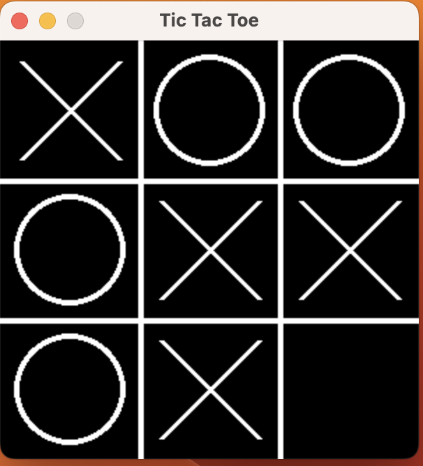

# Tic Tac Toe 

## Description

This is a simple Tic Tac Toe game that is implemented on a regular 3x3 board with normal tic tac toe rules. Once a player 
gets 3 X's or O's in a row or there is a draw, the game automatically exits and prints out the winner if there is one.

## How to Play

1. Clone or download the repository to your local machine.

2. Install Python and pygame if not already

